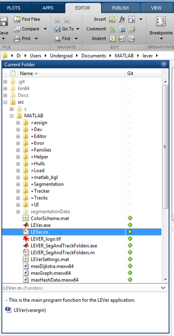
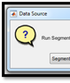
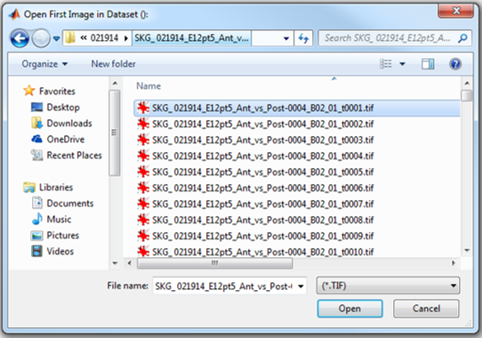
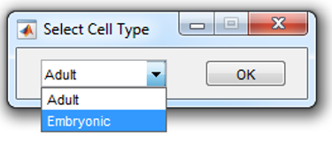

# **LEVer**
### **The Lineaging, Editing and Validation tool**

 (https://git-bioimage.coe.drexel.edu/bioimage/lever/tree/master) program. http://bioimage.coe.drexel.edu

Lever was developed by Drexel University's bioimage lab under the direction of Dr. Andrew Cohen. For more information on our lab click [here](http://bioimage.coe.drexel.edu/info/).

## **Download Instructions**

1. Open https://git-bioimage.coe.drexel.edu/bioimage/lever/tree/master
2. Select Download zip in the top right
3. Select Documents/MATLAB as destination (recommended)

## **Usage Instructions**

**File Naming**
LEVER datasets must be named using the convention

{Experiment Indenfier}_c{channel number}_t{frame number}_z{z value}.

Example: SZV_c02_t0034_Z0001 Designates the second channel, 34th frame and 1 image of the SZV experment dataset.

**Running LEVer.m**
1. Open MATLAB and set current directory to Documents/MATLAB/LEVER/SRC/MATLAB
  
2. Run LEVer in the command Window
3. Chose 'Segment & Track'
  
4. Select the first tiff image of the dataset following the convention discussed below
  

5. Chose the correct Segmentation Algorithm that corresponds with the cell and microscopy type
  

6. Select the location for the .mat file where the data will be stored

## **Key Features of LEVER**

#### **Implementation of Segmentation Algorithms**
Allows users to segment images using a range analysis algorithms developed in MATLAB

#### **Multitemporial tracking and Lineaging of cells**
Results of the segmentation can be tracked in order to observe cellular behavior over time and across various cell cycles

### **Additional Information**
For more information on Global Structures, Major Functions and User controls please see the Git wiki page at https://git-bioimage.coe.drexel.edu/bioimage/lever/wikis/home

### **License**
Copyright 2015 Andrew Cohen

LEVer is free software: you can redistribute it and/or modify
it under the terms of the GNU General Public License as published by
the Free Software Foundation, either version 3 of the License, or
(at your option) any later version.
LEVer is distributed in the hope that it will be useful,
but WITHOUT ANY WARRANTY; without even the implied warranty of
MERCHANTABILITY or FITNESS FOR A PARTICULAR PURPOSE.  See the
GNU General Public License for more details.

You should have received a copy of the GNU General Public License
along with LEVer in file "gnu gpl v3.txt".  If not, see
<http://www.gnu.org/licenses/>.

## **Publications**
